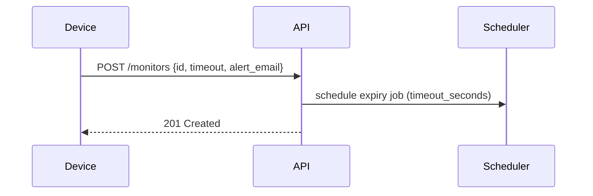
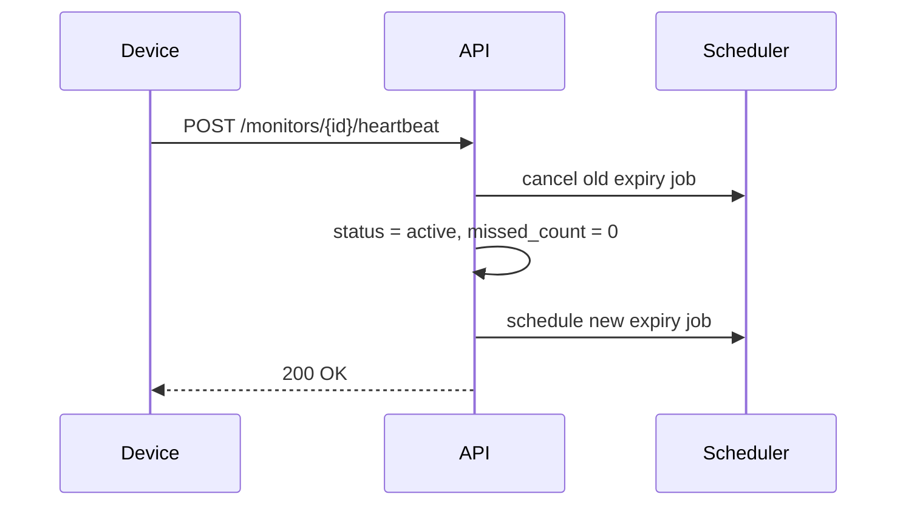
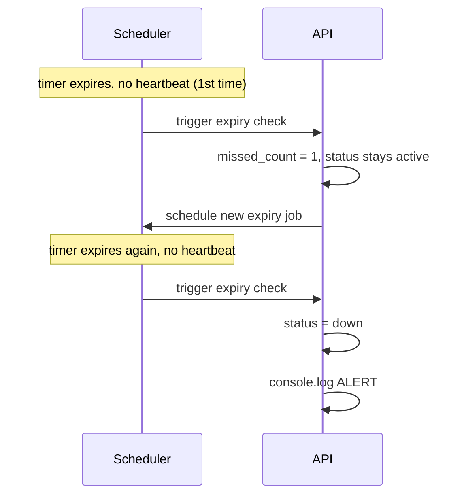
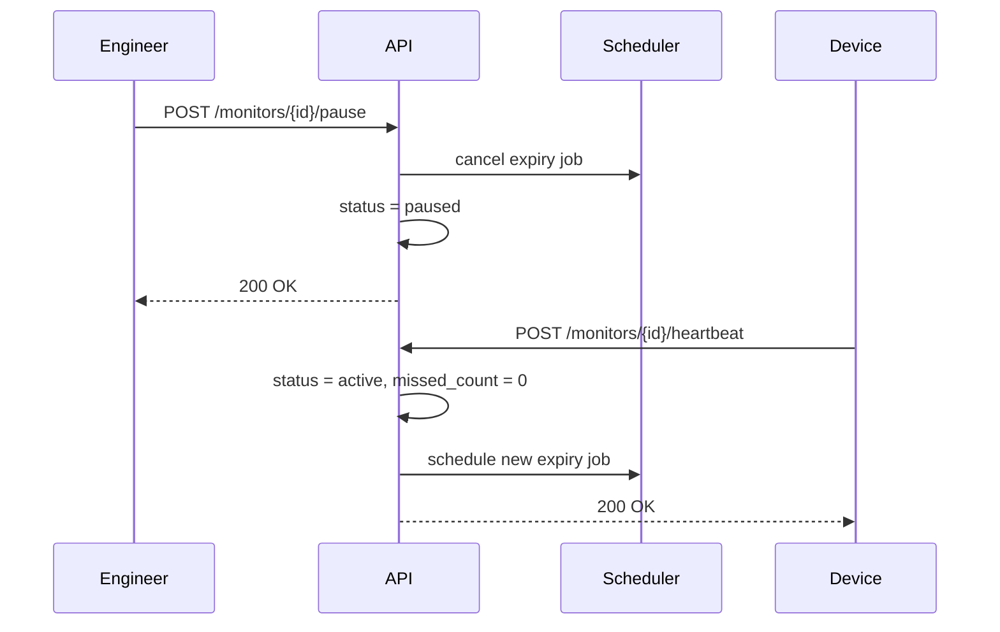

# Pulse-Check-API ("Watchdog" Sentinel)

A Dead Man's Switch monitoring API built with **Flask**. Devices register a monitor with a countdown timer, send periodic heartbeats to stay "alive," and trigger an alert if they go silent for too long.

---

## 1. Architecture & Design Decisions

This design includes one deliberate addition beyond the base spec: a **grace period** for missed heartbeats. Rather than marking a device `down` the instant a single heartbeat is missed, the system tolerates one consecutive miss before declaring it down — see §4 (Developer's Choice) for the full reasoning. This decision shapes the data model and state machine below, so it's introduced here first.

### 1.1 Data Model

Each monitor is represented with the following fields:

| Field             | Type                             | Purpose                                                                                              |
| ----------------- | -------------------------------- | ---------------------------------------------------------------------------------------------------- |
| `id`              | string                           | Unique identifier for the device (also used as the APScheduler job ID — see §1.3)                    |
| `timeout_seconds` | number                           | How long the countdown runs before a missed heartbeat is registered                                  |
| `alert_email`     | string                           | Destination for the down alert                                                                       |
| `status`          | enum: `active`, `paused`, `down` | Current state of the monitor                                                                         |
| `missed_count`    | integer                          | Tracks consecutive missed heartbeats, used for the grace-period feature (see §3, Developer's Choice) |
| `last_heartbeat`  | timestamp                        | Last time the device checked in; surfaced on status/dashboard endpoints                              |

**Why no separate "grace period" status?** A monitor that has missed one heartbeat isn't dead yet — it's still `active`, just with `missed_count = 1`. `status` answers "is this thing fine, paused, or dead," while `missed_count` separately answers "how close is it to dead." Keeping these as two independent fields (rather than inventing a 4th status value) avoids duplicating state that's already expressible as a combination of the existing two.

### 1.2 State Machine

| From                                           | Event                             | To                                            |
| ---------------------------------------------- | --------------------------------- | --------------------------------------------- |
| `active` (missed_count = 0)                    | Timer expires, no heartbeat       | `active`, `missed_count = 1` (grace used)     |
| `active` (missed_count = 1)                    | Timer expires again, no heartbeat | `down`                                        |
| **any status** (`active`, `paused`, or `down`) | Heartbeat received                | `active`, `missed_count = 0`, timer restarted |
| `active` (any missed_count)                    | Pause called                      | `paused`, timer stopped                       |

**Note:** Heartbeat is intentionally a single universal rule rather than separate "revive from down" and "unpause" rules. A heartbeat is proof-of-life regardless of what state the monitor was previously in, so reset logic doesn't need to branch on prior status — this also means a `down` monitor self-heals the moment the device starts responding again, with no manual reset endpoint required.

### 1.3 Timer Mechanism

Flask's request/response cycle has no built-in way to "do something after N seconds" independent of an incoming request — by default, nothing happens unless a client sends a request. Since a countdown must expire and fire _without_ any request occurring, this project uses **APScheduler's `BackgroundScheduler`**, which runs on its own thread alongside Flask and can schedule callbacks for arbitrary future times.

- **Job ID = device `id`.** Since device IDs are already guaranteed unique (they're the primary key for monitor lookups), reusing the same `id` as the scheduler's job ID means any job can be looked up, cancelled, or rescheduled in O(1) by key — no scanning through all active jobs.
- **On registration:** a new job is scheduled to fire after `timeout_seconds`.
- **On heartbeat:** the existing job for that `id` is cancelled and a fresh one is scheduled.
- **On pause:** the job for that `id` is cancelled outright, with no replacement.
- **On job fire (no heartbeat received):** the grace-period logic in §1.2 runs — increment `missed_count` and reschedule, or mark `down`.

### 1.4 Concurrency

Because the scheduler runs on a separate thread from Flask's request handlers, the same monitor record can be read/written from two different threads at nearly the same instant (e.g. a heartbeat arrives just as that device's expiry job fires). This is a classic race condition.

A `threading.Lock()` guards every read-modify-write operation on a monitor's shared fields (`status`, `missed_count`):

- **Heartbeat** — reads and rewrites `status`/`missed_count`, and touches the scheduler job → locked.
- **Expiry job firing** — reads and rewrites `status`/`missed_count` → locked.
- **Pause** — reads and rewrites `status` → locked.
- **Registration** — _not_ locked. The monitor record doesn't exist yet at the moment of creation, so there is no shared data for another thread to race against; the first heartbeat or expiry job for that device can only occur after registration has already completed.

### 1.5 Sequence Diagrams

**Registration**

**Heartbeat (normal reset)**

**Timeout → Grace → Down**

**Pause / Unpause**

---

## 2. Setup Instructions

> _TODO — fill in once the Flask project is built (dependencies, how to run, environment variables, etc.)_

---

## 3. API Documentation

> _TODO — fill in endpoint list + example requests/responses once endpoints are implemented._

---

## 4. The Developer's Choice

**Feature added: Grace period for missed heartbeats.**

The original brief marks a device `down` the instant a single heartbeat is missed. Given the stated context, solar farms and weather stations in areas with poor connectivity, this is too strict: a single dropped packet would trigger a false alarm and send a repair team on an unnecessary trip. Allowing one missed heartbeat before declaring `down` (tracked via `missed_count`, see §1.1–1.2) tolerates a single transient network failure while still catching genuine outages on the second consecutive miss.

> _TODO — expand with any concrete example/log output once implemented._
