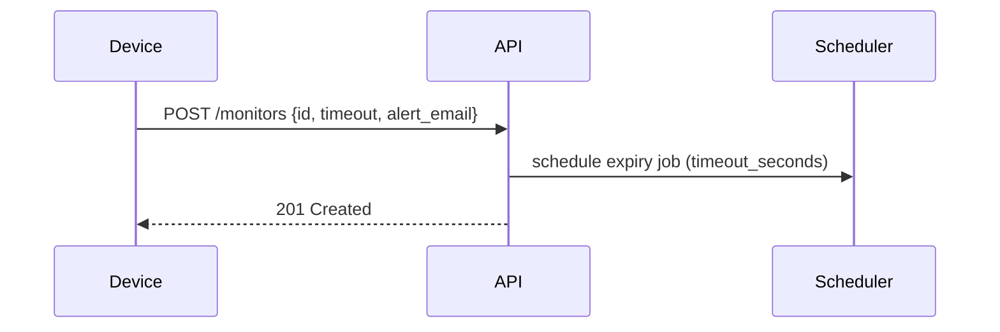
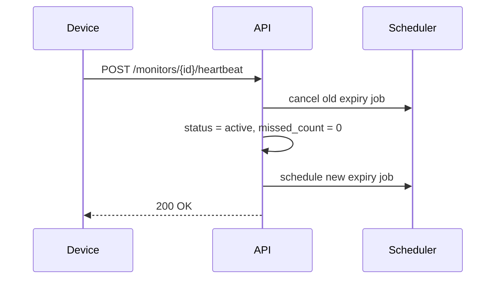
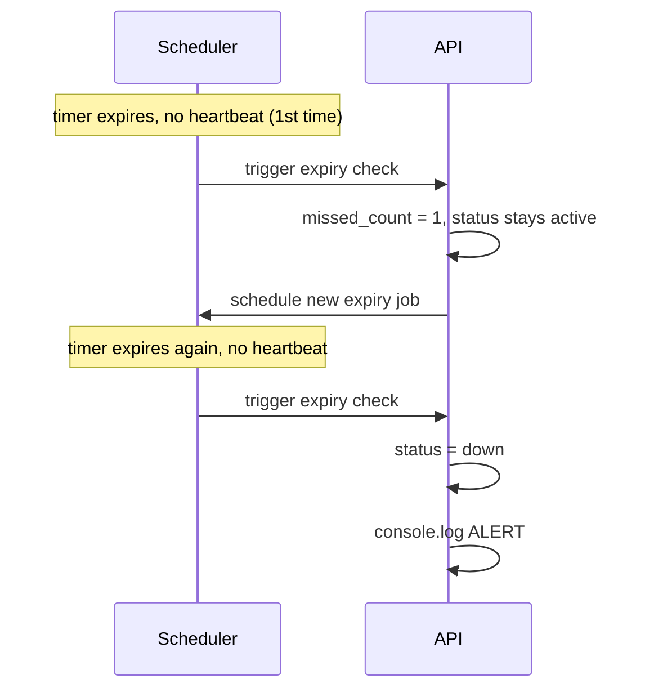
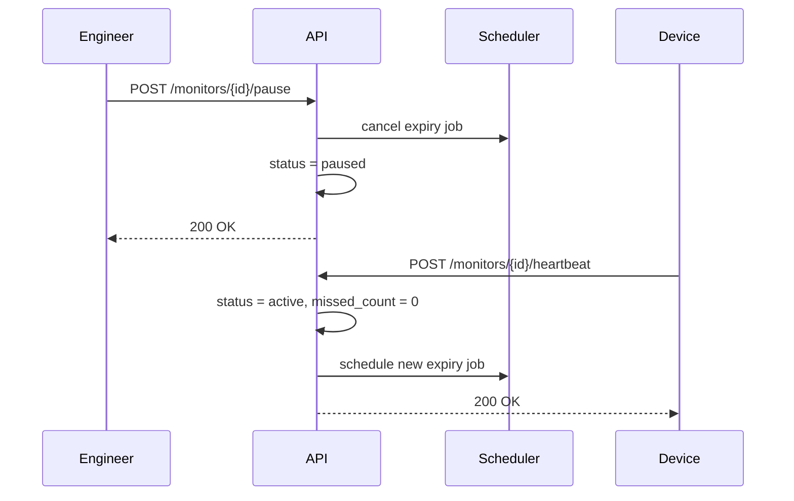

# Pulse-Check-API ("Watchdog" Sentinel)

A Dead Man's Switch monitoring API built with **Flask**. Devices register a monitor with a countdown timer, send periodic heartbeats to stay "alive," and trigger an alert if they go silent for too long.

---

## 1. Architecture & Design Decisions

This design includes one deliberate addition beyond the base spec: a **grace period** for missed heartbeats. Rather than marking a device `down` the instant a single heartbeat is missed, the system tolerates one consecutive miss before declaring it down, see §4 (Developer's Choice) for the full reasoning. This decision shapes the data model and state machine below, so it's introduced here first.

### 1.1 Data Model

Each monitor is represented with the following fields:

| Field             | Type                             | Purpose                                                                                              |
| ----------------- | -------------------------------- | ---------------------------------------------------------------------------------------------------- |
| `id`              | string                           | Unique identifier for the device (also used as the APScheduler job ID — see §1.3)                    |
| `timeout_seconds` | number                           | How long the countdown runs before a missed heartbeat is registered                                  |
| `alert_email`     | string                           | Destination for the down alert                                                                       |
| `status`          | enum: `active`, `paused`, `down` | Current state of the monitor                                                                         |
| `missed_count`    | integer                          | Tracks consecutive missed heartbeats, used for the grace-period feature (see §3, Developer's Choice) |
| `last_heartbeat`  | timestamp                        | Last time the device checked in; surfaced on status/dashboard endpoints                              |

**Why no separate "grace period" status?** A monitor that has missed one heartbeat isn't dead yet, it's still `active`, just with `missed_count = 1`. `status` answers "is this thing fine, paused, or dead," while `missed_count` separately answers "how close is it to dead." Keeping these as two independent fields (rather than inventing a 4th status value) avoids duplicating state that's already expressible as a combination of the existing two.

### 1.2 State Machine

| From                                           | Event                             | To                                            |
| ---------------------------------------------- | --------------------------------- | --------------------------------------------- |
| `active` (missed_count = 0)                    | Timer expires, no heartbeat       | `active`, `missed_count = 1` (grace used)     |
| `active` (missed_count = 1)                    | Timer expires again, no heartbeat | `down`                                        |
| **any status** (`active`, `paused`, or `down`) | Heartbeat received                | `active`, `missed_count = 0`, timer restarted |
| `active` (any missed_count)                    | Pause called                      | `paused`, timer stopped                       |

**Note:** Heartbeat is intentionally a single universal rule rather than separate "revive from down" and "unpause" rules. A heartbeat is proof-of-life regardless of what state the monitor was previously in, so reset logic doesn't need to branch on prior status, this also means a `down` monitor self-heals the moment the device starts responding again, with no manual reset endpoint required.

### 1.3 Timer Mechanism

Flask's request/response cycle has no built-in way to "do something after N seconds" independent of an incoming request by default, nothing happens unless a client sends a request. Since a countdown must expire and fire _without_ any request occurring, this project uses **APScheduler's `BackgroundScheduler`**, which runs on its own thread alongside Flask and can schedule callbacks for arbitrary future times.

- **Job ID = device `id`.** Since device IDs are already guaranteed unique (they're the primary key for monitor lookups), reusing the same `id` as the scheduler's job ID means any job can be looked up, cancelled, or rescheduled in O(1) by key, no scanning through all active jobs.
- **On registration:** a new job is scheduled to fire after `timeout_seconds`.
- **On heartbeat:** the existing job for that `id` is cancelled and a fresh one is scheduled.
- **On pause:** the job for that `id` is cancelled outright, with no replacement.
- **On job fire (no heartbeat received):** the grace-period logic in §1.2 runs — increment `missed_count` and reschedule, or mark `down`.

### 1.4 Concurrency

Because the scheduler runs on a separate thread from Flask's request handlers, the same monitor record can be read/written from two different threads at nearly the same instant (e.g. a heartbeat arrives just as that device's expiry job fires). This is a classic race condition.

A `threading.Lock()` guards every read-modify-write operation on a monitor's shared fields (`status`, `missed_count`):

- **Heartbeat** — reads and rewrites `status`/`missed_count`, and touches the scheduler job → locked.
- **Expiry job firing** — reads and rewrites `status`/`missed_count` → locked.
- **Pause** — reads and rewrites `status` → locked.
- **Registration** — _not_ locked. The monitor record doesn't exist yet at the moment of creation, so there is no shared data for another thread to race against; the first heartbeat or expiry job for that device can only occur after registration has already completed.

### 1.5 Sequence Diagrams

**Registration**



**Heartbeat (normal reset)**



**Timeout → Grace → Down**



**Pause / Unpause**



---

### 1.6 Known Limitations

This implementation uses an in-memory Python dictionary rather than a database. This was a deliberate scope/time tradeoff not an oversight but it's worth being explicit about the cost: **if the server crashes or restarts, every monitor and its current state (status, missed_count, last_heartbeat) is lost.** For a system pitched as monitoring critical infrastructure, that's a real weakness in a production setting. A production version would persist monitor state (e.g. to SQLite or Postgres) and reload/reschedule all active jobs on startup, so an unplanned restart doesn't silently stop tracking every device until someone notices.

---

## 2. Setup Instructions

**Requirements:** Python 3.9+

1. Clone your fork and move into the project folder:

   ```bash
   git clone https://github.com/<your-username>/<your-fork>.git
   cd <your-fork>
   ```

2. Create and activate a virtual environment:

   ```bash
   python3 -m venv venv
   source venv/bin/activate      # On Windows: venv\Scripts\activate
   ```

3. Install dependencies:

   ```bash
   pip install -r requirements.txt
   ```

4. Run the server:
   ```bash
   python app.py
   ```

The API will be running at `http://127.0.0.1:5000`.

No environment variables or external services (database, email provider) are required, the system uses in-memory storage and logs alerts to the console rather than sending real emails (see §4, Developer's Choice, for the reasoning).

---

## 3. API Documentation

All request and response bodies are JSON.

### `POST /monitors`

Registers a new monitor and starts its countdown.

**Request body:**

```json
{
  "id": "device-1",
  "timeout": 60,
  "alert_email": "admin@critmon.com"
}
```

**Success response — `201 Created`:**

```json
{
  "id": "device-1",
  "timeout_seconds": 60,
  "alert_email": "admin@critmon.com",
  "status": "active",
  "missed_count": 0,
  "last_heartbeat": "2026-06-25T12:00:00+00:00"
}
```

**Error responses:**

- `400 Bad Request` — `{"error": "Missing required fields"}` if `id`, `timeout`, or `alert_email` is missing.
- `400 Bad Request` — `{"error": "Monitor already exists for this device_id"}` if the `id` is already registered.

---

### `POST /monitors/<id>/heartbeat`

Resets the countdown for an existing monitor. Works regardless of the monitor's current status - a `paused` or `down` monitor is revived to `active` by a heartbeat, same as a normal reset (see §1.2, State Machine).

**Request body:** none required.

**Success response — `200 OK`:**

```json
{ "message": "Heartbeat received" }
```

**Error response:**

- `404 Not Found` — `{"error": "Monitor not found"}` if `id` doesn't exist.

---

### `POST /monitors/<id>/pause`

Stops the countdown for a monitor entirely. No alert will fire while paused. Sending a heartbeat to a paused monitor automatically un-pauses it and restarts the timer.

**Request body:** none required.

**Success response — `200 OK`:**

```json
{ "message": "Monitor paused" }
```

**Error response:**

- `404 Not Found` — `{"error": "Monitor not found"}` if `id` doesn't exist.

---

### Console Logging (no endpoint — internal behavior)

Beyond the down alert (required by User Story 3), this project logs key lifecycle events to the console for visibility during testing and operation, since there's no dashboard UI:

- **Heartbeat received:**
  ```
  Heartbeat received for device_id device-1. Resetting expiry timer.
  ```
- **Grace period used (first missed heartbeat):**
  ```
  first grace period heartbeat missed for device_id device-1. Missed count: 1
  ```
- **Monitor paused:**
  ```
  Monitor for device_id device-1 has been paused. Expiry timer canceled... Call heartbeat to resume monitoring.
  ```
- **Down alert (second consecutive missed heartbeat — see §4):**
  ```
  ALERT: Monitor for device_id device-1 has expired. Sending alert to admin@critmon.com
  ```

---

## 4. The Developer's Choice

**Feature added: Grace period for missed heartbeats.**

The original brief marks a device `down` the instant a single heartbeat is missed. Given the stated context — solar farms and weather stations in areas with poor connectivity, this is too strict: a single dropped packet would trigger a false alarm and send a repair team on an unnecessary trip. Allowing one missed heartbeat before declaring `down` (tracked via `missed_count`, see §1.1–1.2) tolerates a single transient network failure while still catching genuine outages on the second consecutive miss.

**Example walkthrough** (observed during testing, with `timeout` set to 5 seconds to make the sequence easy to watch):

1. `t=0s` — `POST /monitors` registers `device-1` with `timeout: 5`. Status: `active`, `missed_count: 0`.
2. `t=5s` — no heartbeat arrives. First miss is forgiven: `missed_count` becomes `1`, status stays `active`, and the timer restarts for another 5 seconds.
   ```
   first grace period heartbeat missed for device_id device-1. Missed count: 1
   ```
3. `t=10s` — still no heartbeat. The grace period is now exhausted: status becomes `down`.
   ```
   ALERT: Monitor for device_id device-1 has expired. Sending alert to admin@critmon.com
   ```

If a heartbeat had arrived at any point in steps 2 or 3, `missed_count` would have reset to `0` and the device would never have reached `down` — see §1.2 (State Machine) for the full transition rules.
